# MSSE 642 – Software Assurance

**Student:** Shawn Wilkinson
**Course:** MSSE 642 – Software Assurance
**Institution:** Regis University
**Professor:** Randall Granier

---

## Overview

This repository contains coursework for MSSE 642, a graduate-level course focused on software assurance, penetration testing, and security analysis. Assignments include hands-on lab work using industry-standard tools such as Kali Linux, Nessus, and Metasploit.

---

## Lab Environment

| Component | Details |
|---|---|
| Host OS | macOS |
| Hypervisor | Oracle VirtualBox (Type 2) |
| Attacker VM | Kali Linux 2026.1 |
| Target VM | Metasploitable |
| Network | VirtualBox NAT Network (`pentestlab`) |
| Scanner | Tenable Nessus |

---

## Repository Structure

```
assignments/
  weekly-projects/
    images/                  # Screenshots for project write-ups
    project-1-labsetup.md    # Assignment #1: Lab Setup
    project-2-threat-analysis.md  # Assignment #2: Threat Analysis
    project-3-penlab-1.md    # Assignment #3: Penetration Testing Part 1
    project-4-penlab-2.md    # Assignment #4: Penetration Testing Part 2
```

---

## Assignments

| Assignment | Description | Status |
|---|---|---|
| [Assignment #1](assignments/weekly-projects/project-1-labsetup.md) | Penetration Testing Lab Setup – Kali Linux + Metasploitable on VirtualBox | Complete |
| [Assignment #2](assignments/weekly-projects/project-2-threat-analysis.md) | Threat Analysis | Complete |
| [Assignment #3](assignments/weekly-projects/project-3-penlab-1.md) | Penetration Testing Part 1 – Nessus & Metasploit | Complete |
| [Assignment #4](assignments/weekly-projects/project-4-penlab-2.md) | Penetration Testing Part 2 – Hiking Club App + OWASP ZAP | Complete |

---

## Project 4 Screenshots

### Hiking Club Web Application

| | |
|---|---|
| 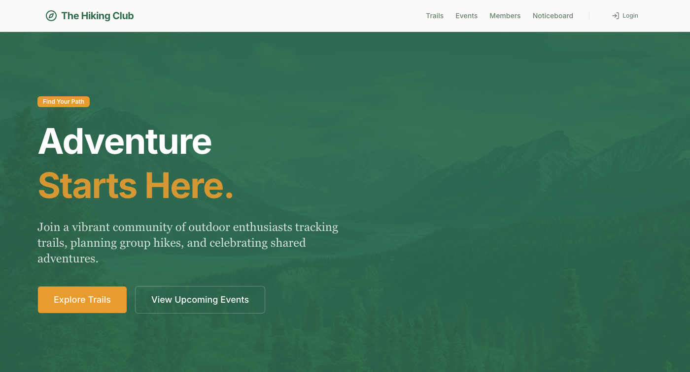 | 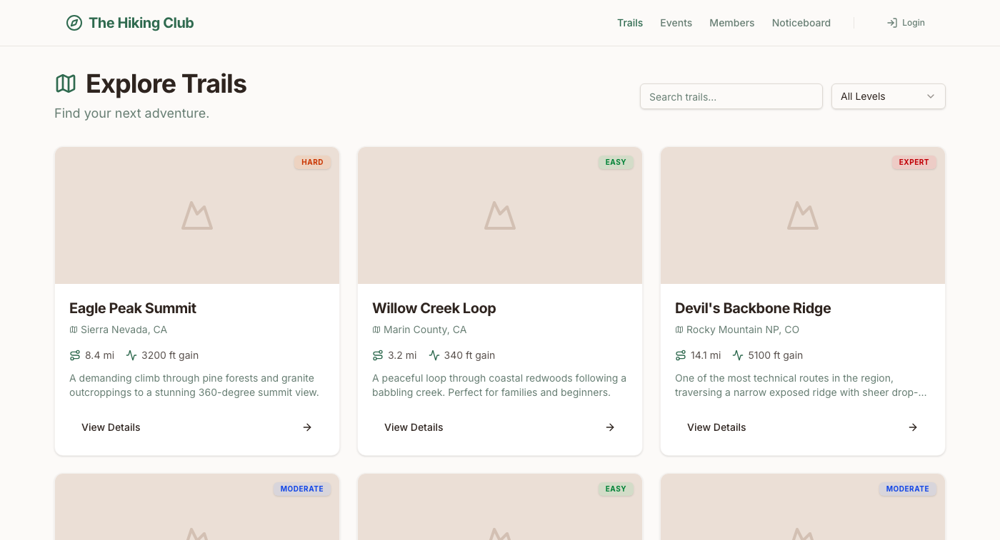 |
| Home Page | Trail Listings |
| 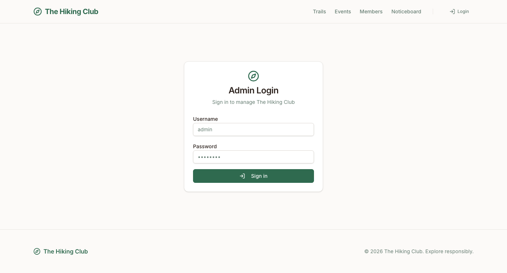 | 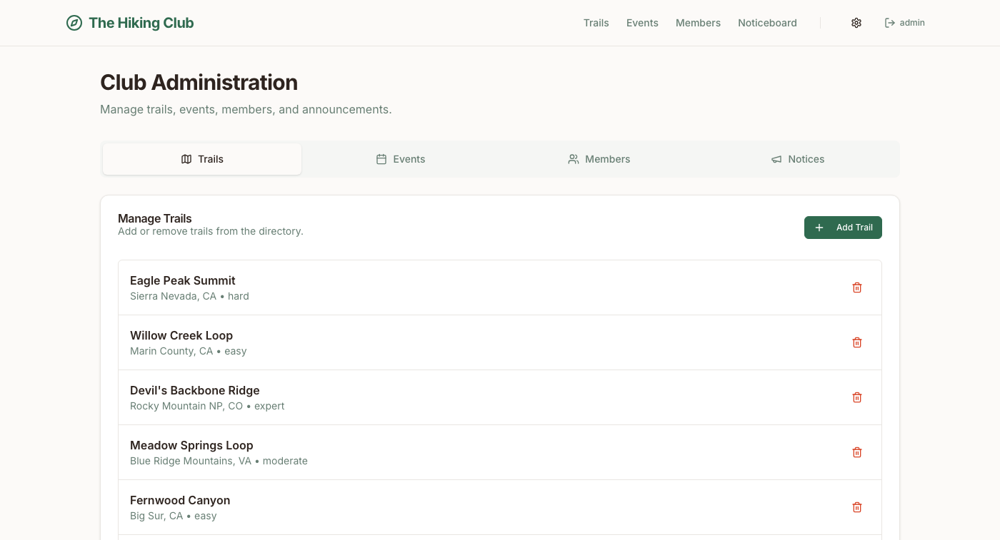 |
| JWT Login Form | Protected Admin Dashboard |
| 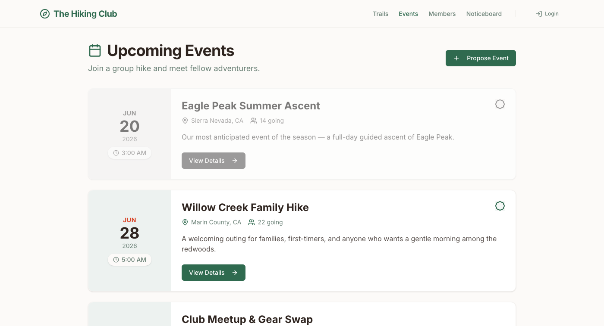 | 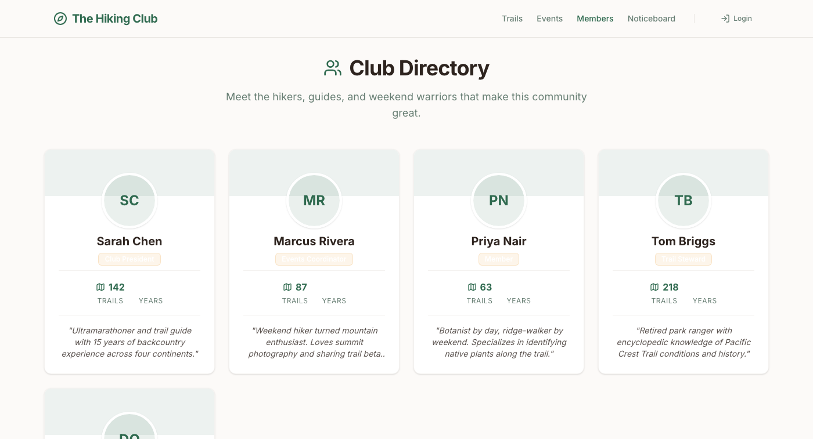 |
| Upcoming Events | Member Directory |
| 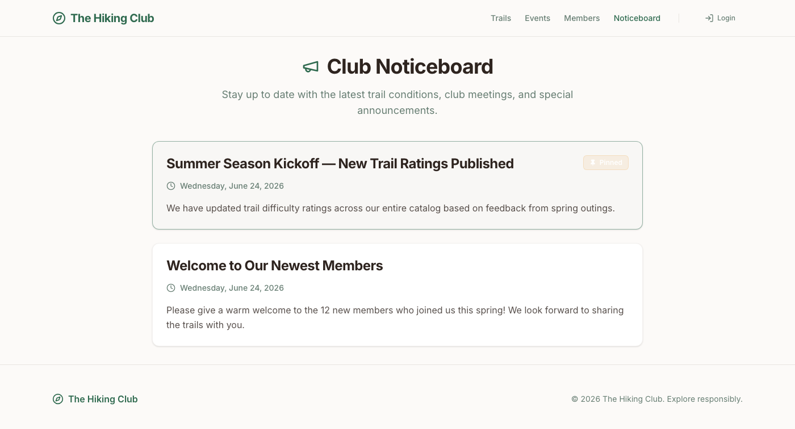 | 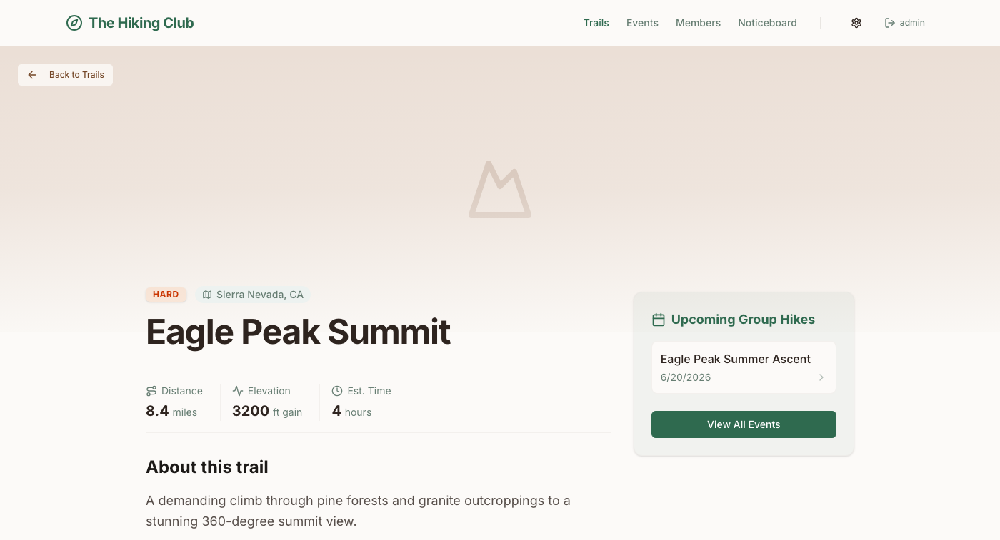 |
| Club Noticeboard | Trail Detail Page |

### Deployment on Kali Linux VM

| | |
|---|---|
| 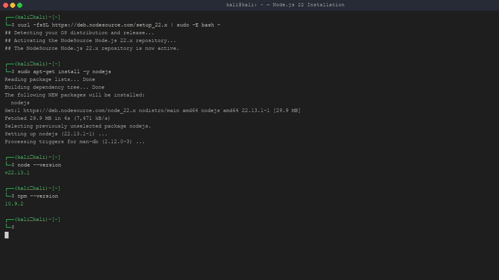 | 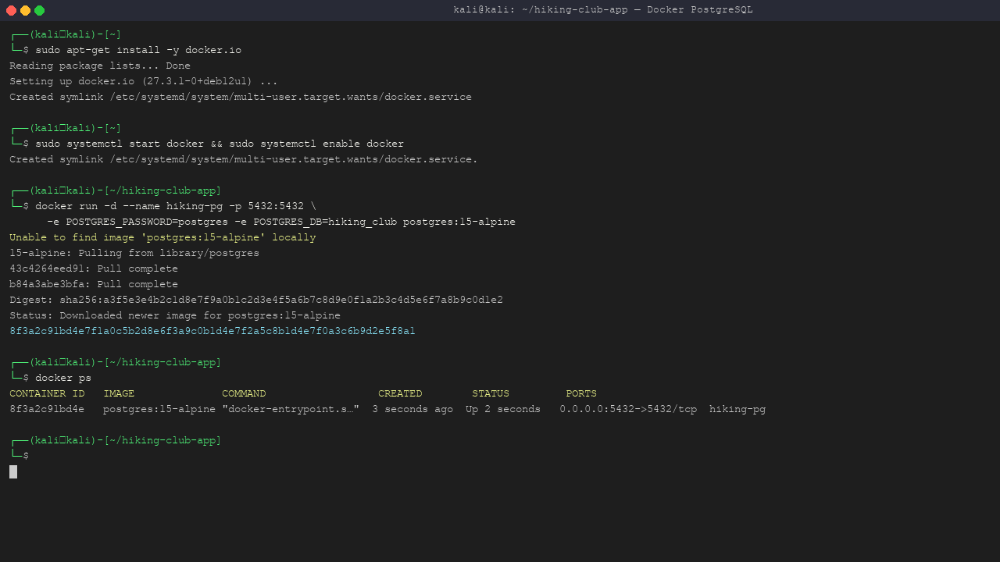 |
| Node.js 22 installed on Kali VM | PostgreSQL running in Docker |
| 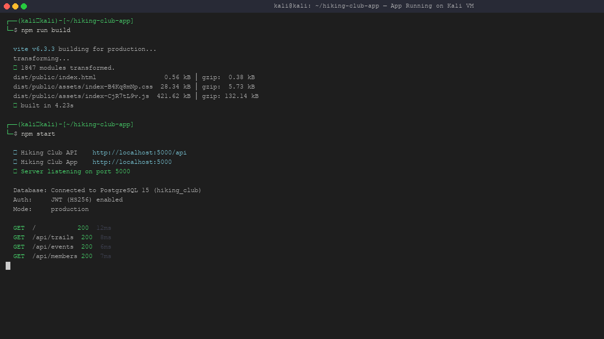 | 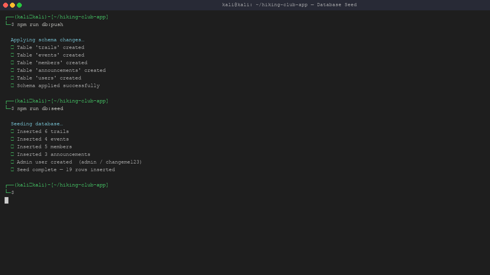 |
| App running at localhost:5000 on Kali VM | Database seeded successfully |

### OWASP ZAP Penetration Testing

| | |
|---|---|
| 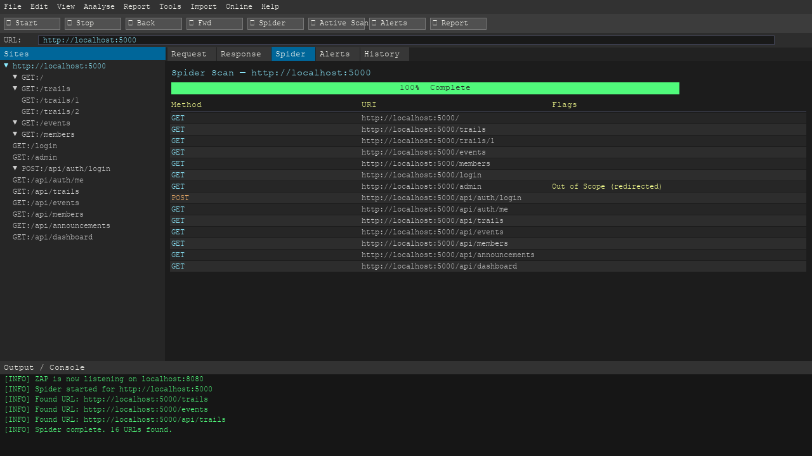 | 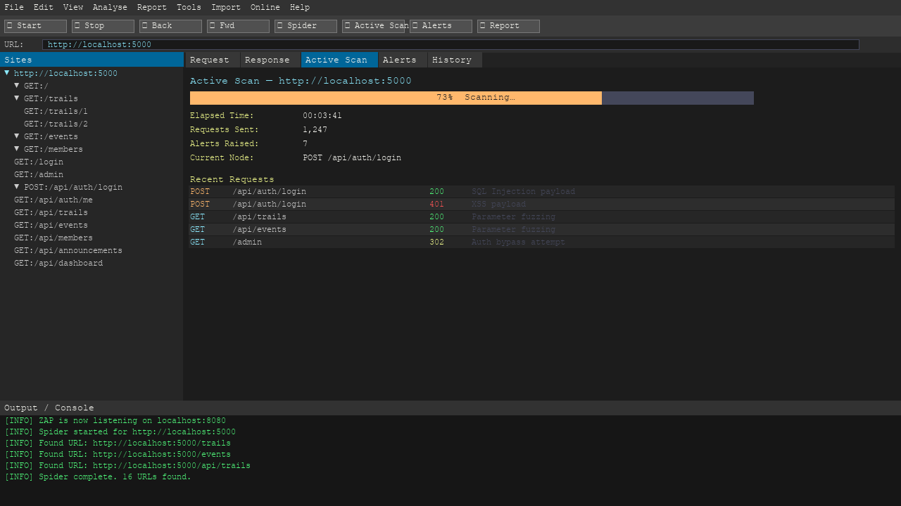 |
| ZAP Spider – 16 URLs discovered | Active scanner in progress |
| 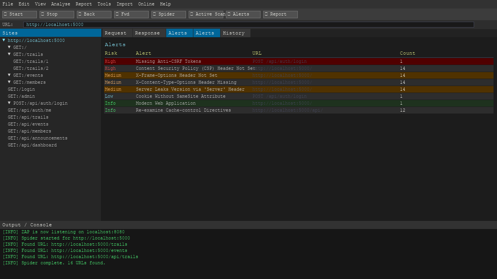 | 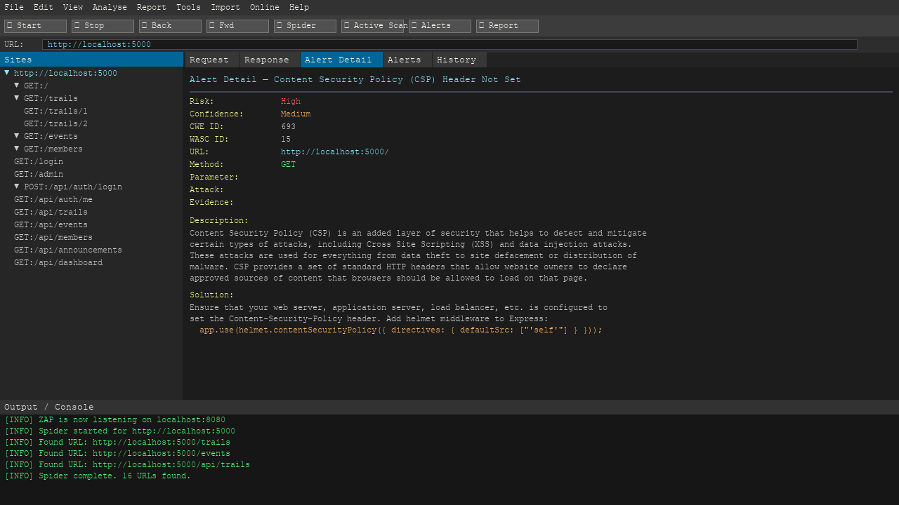 |
| Alerts panel – findings by risk level | Missing CSP header alert detail |
| 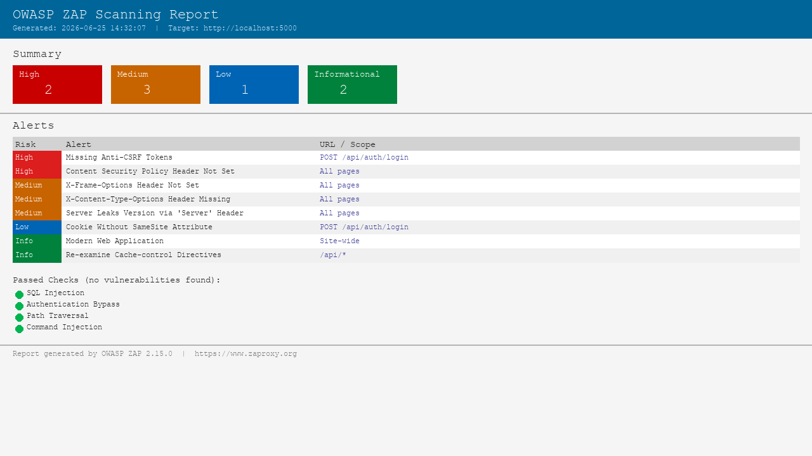 | |
| ZAP HTML summary report | |

---

## Tools & Technologies

- **Kali Linux** – Penetration testing distribution
- **Oracle VirtualBox** – Type 2 hypervisor for running VMs
- **Tenable Nessus** – Vulnerability scanner
- **Metasploitable** – Intentionally vulnerable target VM
- **Metasploit Framework** – Exploitation framework (built into Kali)
- **Burp Suite** – Web application proxy and information gathering
- **OWASP ZAP** – Web application active scanner
- **Claude Code** – Agentic coding tool used to build the Hiking Club app
